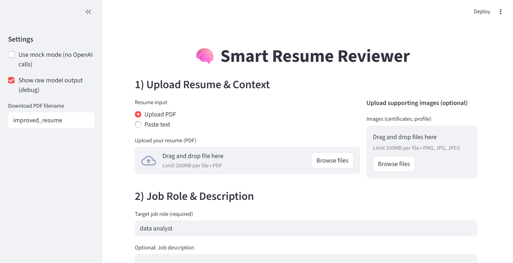
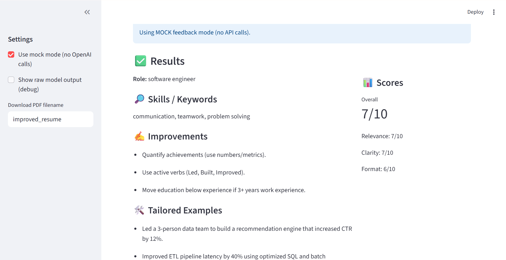
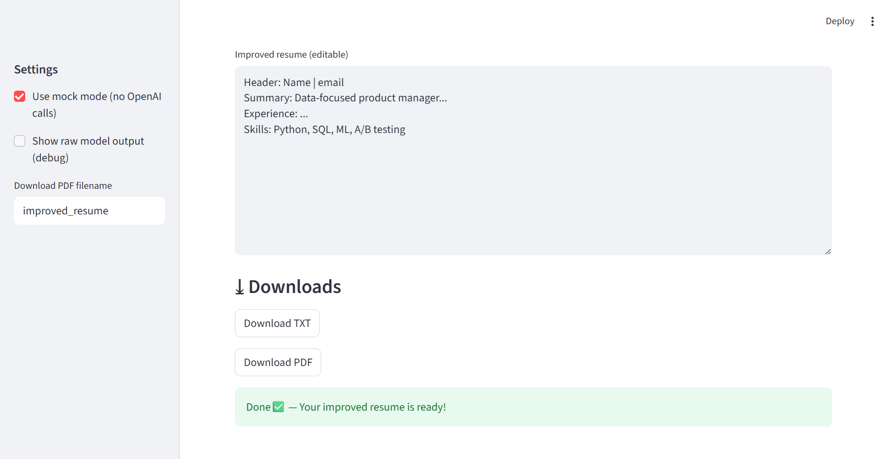
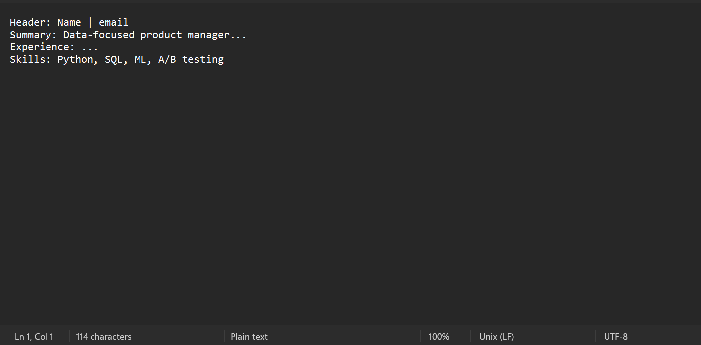
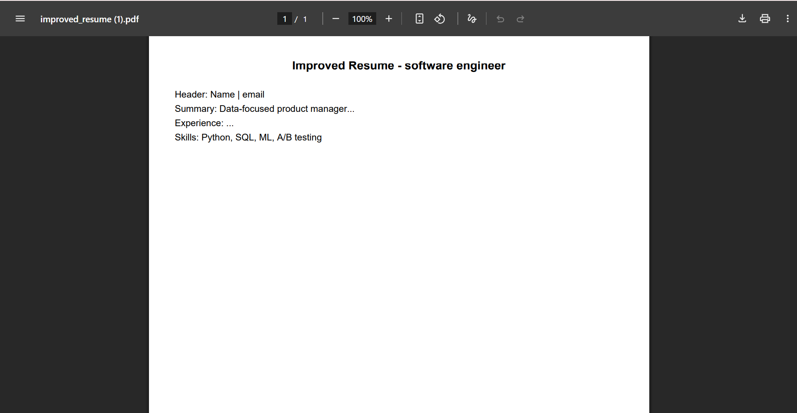

# Smart Resume Reviewer

**Smart Resume Reviewer** is a hackathon project designed to **analyze and improve resumes** using AI/ML techniques. It helps job seekers create **impactful and professional resumes** tailored to specific job roles.

---

## 🔹 Team Members
- Shrinkhla Saxena
- Rudraksh Chauhan
---

## 🔹 Features
- Automatically analyzes resumes for **keywords, formatting, and clarity**.
- Provides **improvement suggestions** based on the target job role.
- Generates an **improved PDF resume**.
- User-friendly interface for uploading resumes.

---

## 🔹 Tech Stack
- **Frontend:** HTML, CSS, JavaScript  
- **Backend:** Python (Flask)  
- **Libraries:** PyPDF2, NLP libraries, etc.  
- **Version Control:** Git & GitHub

---

## 🔹 How to Run Locally
1. Clone the repository:

   ```bash
   git clone https://github.com/rudraksh029/resume-review-app.git






